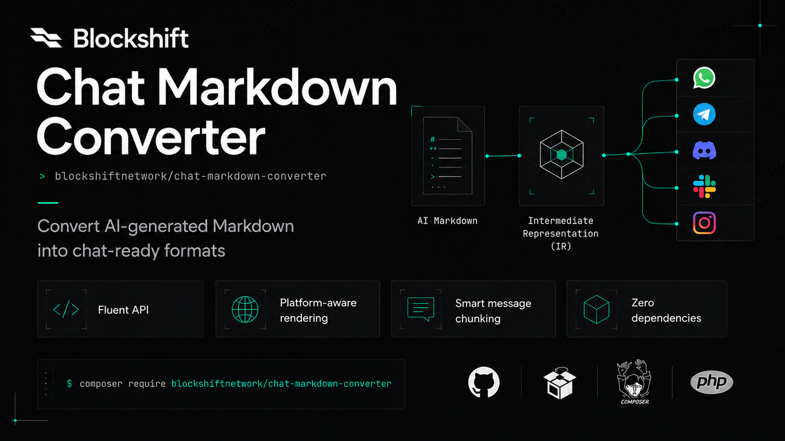

# Chat Markdown Converter

<p align="center">
  
</p>

|[](https://packagist.org/packages/blockshiftnetwork/chat-markdown-converter)
|[](https://github.com/blockshiftnetwork/chat-markdown-converter/actions/workflows/run-tests.yml)
|[](https://packagist.org/packages/blockshiftnetwork/chat-markdown-converter)

Convert AI-generated Markdown to WhatsApp, Telegram, Discord and Slack formats using an Intermediate Representation (IR). Perfect for converting LLM responses to chat-friendly formats.

This PHP library transforms ChatGPT, Claude, GPT-5, and other AI model outputs into platform-specific markup. It handles code blocks, tables, lists, links, and rich text formatting while maintaining readability across all supported platforms.

## Features

- Fluent API with chainable method calls
- Clean architecture using the Intermediate Representation pattern for extensibility
- Comprehensive test coverage with 168 passing tests (Pest)
- Platform-specific rendering optimized for each chat platform
- Smart message chunking that splits text at safe breakpoints
- Zero external dependencies, lightweight implementation

## Use Cases

### AI Chatbots & Virtual Assistants
Send formatted responses from OpenAI, Anthropic, or other LLM APIs directly to users via their preferred messaging platform. Ensure code blocks, tables, and lists render correctly across Telegram, WhatsApp, Discord, and Slack.

### Customer Support Automation
Automate support workflows by converting AI-generated help articles and documentation into chat-friendly formats. Preserve formatting while delivering concise, readable responses in your customers' channels.

### Developer Tools & DevOps
Integrate with CI/CD pipelines, monitoring systems, or alerting platforms to send formatted logs, error messages, or status updates to team channels. Convert Markdown reports to platform-appropriate syntax automatically.

### Content Distribution Systems
Distribute newsletters, summaries, or generated content across multiple platforms simultaneously. Write once in Markdown and automatically convert to Telegram HTML, WhatsApp text, Discord markdown, or Slack mrkdwn.

### Educational Platforms
Convert AI-generated tutorials, code examples, and learning materials into appropriate formats for students across different communication channels. Keep code snippets and syntax highlighting functional.

### Knowledge Base Integration
Transform documentation and wiki content from Markdown sources into chat-appropriate formats for quick distribution via messaging apps. Maintain structure and readability without manual reformatting.

### Notification Systems
Build notification services that send formatted alerts, summaries, and reports from AI analysis tools. Convert complex data presentations into simple, readable messages on any platform.

### Multi-Platform Content Management
Manage content in a single Markdown format while automatically adapting output for different chat platforms' unique formatting requirements and limitations.

### Internal Communication Tools
Streamline internal updates, announcements, and reports by converting Markdown-based company communications to team messaging platforms with proper formatting.

## Installation

You can install the package via composer:

```bash
composer require blockshiftnetwork/chat-markdown-converter
```

## Why Choose This Library?

### Platform-Aware Formatting
Unlike naive Markdown-to-text converters, this library understands each platform's unique limitations and formatting rules. Telegram uses HTML tags, WhatsApp uses asterisk-based formatting, Discord and Slack have their own markdown variants - we handle all these differences automatically.

### Intermediate Representation Architecture
By parsing Markdown into an abstract IR first, we ensure consistent behavior across all platforms. This clean architecture makes it easy to add new platforms or customize rendering logic without modifying the core parser.

### Intelligent Feature Adaptation
Automatically converts complex Markdown features to platform-compatible formats:
- Tables become bullet lists on platforms without native table support
- Code blocks are preserved with proper language tags
- Task lists adapt to each platform's checkbox syntax or emoji alternatives
- Links transform to each platform's expected format

### Production-Ready Reliability
Comprehensive test coverage (168+ tests) ensures consistent behavior across edge cases. Handle special characters, nested formatting, mixed content types, and Unicode/emoji support with confidence.

### Developer Experience
Simple, intuitive API with fluent method chaining. Convert in one line with static methods or take full control with the flexible parser options. Zero learning curve for Markdown developers.

### Performance Optimized
Lightweight implementation with no external dependencies. Fast parsing and rendering suitable for high-volume applications and real-time chat systems.

### AI-Response Ready
Specifically designed for LLM outputs that often include code blocks, tables, lists, and mixed formatting. Preserve the intelligence of AI responses while making them platform-appropriate.

### Open Source & Extensible
MIT license, active development, and contribution-friendly architecture. Easily create custom renderers for proprietary platforms or specialized use cases.

## Alternative Approaches

### Direct Markdown-to-Text Conversion
Simple converters often strip all formatting or produce unreadable output. Our platform-specific renderers preserve structure and readability while respecting each platform's formatting capabilities.

### Multiple Separate Libraries
Using different libraries for each platform adds complexity and dependencies. Our unified solution provides consistent behavior across all platforms with a single, well-tested codebase.

### Manual Reformatting
Manually writing separate responses for each platform is time-consuming and error-prone. Automate with our converter and maintain content consistency while reaching users everywhere.

### Regular Expression Replacements
Naive regex-based converters fail with nested formatting, special characters, and complex structures. Our parser handles all edge cases correctly with proper state management.

## Usage

### Quick Conversion

```php
use Blockshift\ChatMarkdown\MarkdownConverter;

// Telegram (HTML format)
$telegram = MarkdownConverter::toTelegram($markdown);

// WhatsApp (Markdown format)
$whatsapp = MarkdownConverter::toWhatsApp($markdown);

// Discord (Markdown format)
$discord = MarkdownConverter::toDiscord($markdown);

// Slack (mrkdwn format)
$slack = MarkdownConverter::toSlack($markdown);
```

### Fluent API

```php
use Blockshift\ChatMarkdown\MarkdownConverter;
use Blockshift\ChatMarkdown\Renderers\TelegramRenderer;

$result = MarkdownConverter::parse($markdown)
    ->withOptions([
        'table_mode' => 'bullets',
        'parse_tables' => true,
    ])
    ->using(new TelegramRenderer)
    ->render();
```

### With Message Chunking

```php
use Blockshift\ChatMarkdown\MarkdownConverter;

$longText = str_repeat('This is a long message. ', 500);

$chunks = MarkdownConverter::toTelegram($longText, maxLength: 4096);
// Returns array of chunks, each under 4096 characters
```

### Custom Renderer

```php
use Blockshift\ChatMarkdown\MarkdownConverter;
use Blockshift\ChatMarkdown\Renderers\AbstractRenderer;
use Blockshift\ChatMarkdown\Support\IntermediateRepresentation;

class CustomRenderer extends AbstractRenderer
{
    protected function renderBlock(array $block): string
    {
        return match ($block['type']) {
            'paragraph' => 'PARA: '.$block['content'],
            'code' => 'CODE: '.$block['content'],
            default => '',
        };
    }
}

$result = MarkdownConverter::parse($markdown)
    ->using(new CustomRenderer)
    ->render();
```

### Parser Options

```php
MarkdownConverter::parse($markdown)->withOptions([
    'table_mode' => 'bullets',  // 'bullets' (default) or 'off'
    'parse_tables' => true,
    'parse_code_blocks' => true,
    'parse_links' => true,
    'parse_styles' => true,
    'parse_blockquotes' => true,
    'parse_horizontal_rules' => true,
    'parse_headers' => true,
]);
```

## Supported Features

### Currently Supported

- Text Formatting: Bold, italic, strikethrough, inline code, highlight
- Headers: Markdown headings (# ## ###)
- Code Blocks: Code blocks with language preservation
- Task Lists: Checkbox support with emoji conversion (WhatsApp)
- Links: Markdown link formatting
- Images: Image formatting
- Lists: Numbered and bullet lists
- Blockquotes: Quote blocks
- Tables: Auto-converted to bullet lists for non-table platforms
- Message Chunking: Smart text splitting with safe breakpoints
- Unicode Support: Full UTF-8 support including emojis
- Multiple Platforms: Telegram, WhatsApp, Discord, Slack

### Platform-Specific Features

#### Telegram (HTML Mode)

- Bold: `<b>text</b>`
- Italic: `<i>text</i>`
- Strikethrough: `<s>text</s>`
- Highlight: `<b>text</b>`
- Inline Code: `<code>text</code>`
- Code Blocks: `<pre>code</pre>`
- Headers: `<b>text</b>` (bold)
- Links: `<a href="url">text</a>`
- Images: `<a href="url">text</a>` (without !)
- Task Lists: `- [x]` and `- [ ]` (native support)

#### WhatsApp

- Bold: `*text*` (single asterisk)
- Italic: `_text_` (underscore)
- Strikethrough: `~text~` (single tilde)
- Highlight: `*text*` (bold)
- Inline Code: `` `text` `` (backticks)
- Code Blocks: Triple backticks
- Headers: `*text*` (bold, replaces # syntax)
- Links: `text: url` (colon separator)
- Images: `text: url` (without !)
- Task Lists: `✅ task` (completed) and `⬜ task` (pending) with emojis

#### Discord

- Bold: `**text**`
- Italic: `*text*` (asterisks only, not underscores)
- Strikethrough: `~~text~~`
- Highlight: `**text**` (bold)
- Inline Code: `` `text` `` (backticks)
- Code Blocks: Triple backticks with language
- Headers: `**text**` (bold, replaces # syntax)
- Links: `[text](url)` (markdown format)
- Images: `[text](url)` (without !)
- Task Lists: `- [x]` and `- [ ]` (native support)

#### Slack

- Bold: `*text*` (single asterisk)
- Strikethrough: `~text~` (single tilde)
- Highlight: `*text*` (bold)
- Inline Code: `` `text` `` (backticks)
- Code Blocks: Triple backticks with language
- Headers: `*text*` (bold, replaces # syntax)
- Links: `<url|text>` (Slack format)
- Images: `<url|text>` (without !)
- Task Lists: `- [x]` and `- [ ]` (native support)

### Roadmap

**Completed**

- Platform-specific link formatting
- Table to bullet conversion
- Headers support
- Highlight syntax
- Image formatting improvements
- Nested/complex formatting

**Planned**

- Telegram MarkdownV2 support
- Additional platforms (Teams, Mattermost, Signal)

## Platform Comparison

| Feature | Telegram | WhatsApp | Discord | Slack |
|---------|----------|----------|---------|-------|
| Format Type | HTML | Text | Markdown | mrkdwn |
| Bold | `<b>` | `*text*` | `**text**` | `*text*` |
| Italic | `<i>` | `_text_` | `*text*` | `_text_` |
| Code | `<code>` | `` ` `` | `` ` `` | `` ` `` |
| Code Blocks | `<pre>` | Triple backticks | Triple backticks | Triple backticks |
| Strikethrough | `<s>` | `~text~` | `~~text~~` | `~text~` |
| Links | `<a href>` | `text: url` | `[text](url)` | `<url\|text>` |
| Tables | Not supported | Not supported | Native support | Not supported |
| Max Message Length | 4096 chars | 4096 chars | 2000 chars | 40000 chars |

## Testing

```bash
composer test
```

```bash
composer test-coverage
```

**Current Test Status**: 168 passed, 1 skipped

## Architecture

The package uses an Intermediate Representation (IR) pattern:

```
Markdown → Parser → IR → Renderer → Platform-Specific Format
```

### Components

- Parser: Converts Markdown to IR
- HeaderParser: Detects and parses markdown headers (# ## ###)
- Parsers: Specialized parsers for code blocks, tables, links, styles, blockquotes, horizontal rules
- Renderers: Platform-specific renderers (Telegram, WhatsApp, Discord, Slack)
- Support: IR, TextChunker

## Contributing

Contributions are welcome! Please see [CONTRIBUTING](https://github.com/spatie/.github/blob/main/CONTRIBUTING.md) for details.

### Development Setup

```bash
# Install dependencies
composer install

# Run tests
composer test

# Format code
composer format
```

## Credits

- [Blockshift Network](https://github.com/blockshiftnetwork)
- [All Contributors](../../contributors)

## FAQ

### Why use an Intermediate Representation instead of direct conversion?
The IR pattern provides better separation of concerns and extensibility. Parse once, render many times. This makes it easy to add new platforms without modifying the parser logic, and ensures consistent behavior across all renderers.

### Can I customize the rendering behavior?
Yes! Extend the `AbstractRenderer` class to create custom renderers. The parser provides a structured IR that you can transform into any format you need.

### How does table conversion work?
For platforms without native table support (Telegram, WhatsApp, Slack), tables are automatically converted to hierarchical bullet lists, preserving the structure and readability.

### Does this library support all Markdown features?
We support the most common Markdown features used in AI responses: headings, code blocks, lists, links, images, blockquotes, horizontal rules, and text formatting. See the Supported Features section for details.

### What about message length limits?
The `TextChunker` intelligently splits long messages at safe breakpoints (after sentences, paragraphs, or list items) while preserving formatting and avoiding broken markup.

### Can I use this with any PHP version?
This library requires PHP 8.3 or higher, taking advantage of modern PHP features like match expressions and readonly properties.

### Is this suitable for production use?
Yes! The library has comprehensive test coverage (168+ tests) and is actively maintained. It's designed for performance and reliability in production environments.

## Optimization Tips

- Reuse parsers: Create a single parser instance and reuse it for multiple conversions
- Batch operations: Process multiple messages in a single request when possible
- Cache rendered output: Store converted results for frequently used content
- Disable unnecessary features: Use parser options to skip parsing for content that doesn't need certain features

## License

The MIT License (MIT). Please see [License File](LICENSE.md) for more information.
